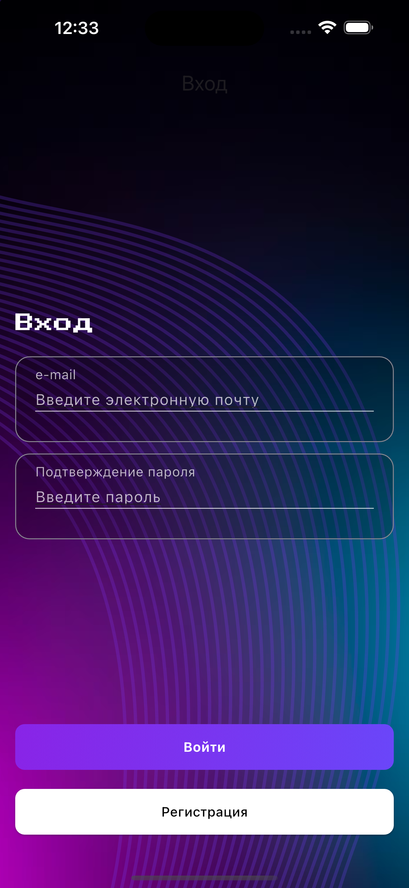
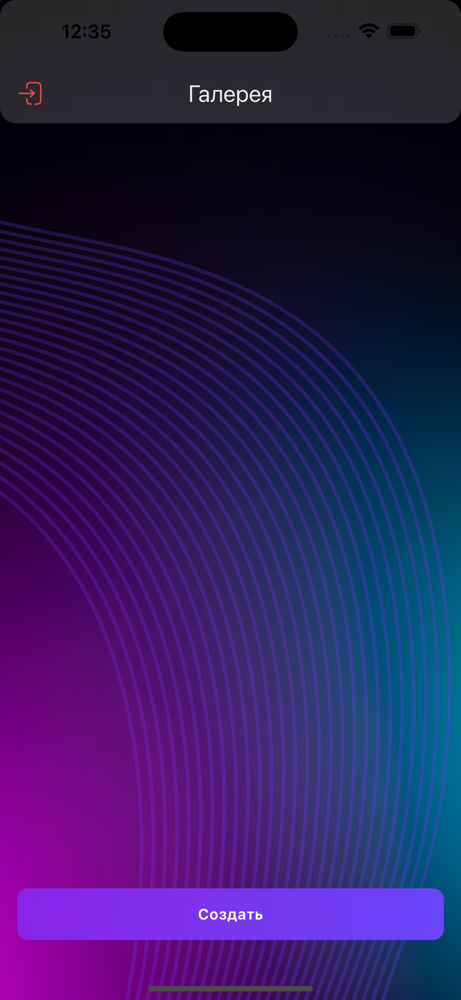
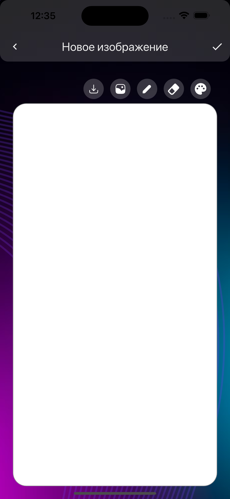

# AezaFlutter

iOS Flutter app with Firebase auth/storage, drawing editor, gallery. Uses BLoC for state,.

## Stack
- Flutter, Dart
- Firebase: Auth, Firestore,
- State: bloc, flutter_bloc
- Media: image_picker, image_gallery_saver, share_plus

## Features
- Email/password sign up/sign in with validation and errors.
- Drawing canvas with brush, eraser, color, thickness, image import.
- Save to gallery and upload to Firebase Storage + Firestore metadata.
- Share sheet export.
- Gallery of user images, tap to open in editor, sign out.

## Описание (Русский)

iOS-приложение на Flutter с аутентификацией Firebase, хранилищем и редактором рисования, а также галереей. Для управления состоянием используется BLoC.

## Стек
- Flutter, Dart
- Firebase: Auth, Firestore
- Состояние: bloc, flutter_bloc
- Медиа: image_picker, image_gallery_saver, share_plus

## Возможности
- Регистрация/вход по email/паролю с валидацией и обработкой ошибок
- Холст для рисования: кисть, ластик, цвет, толщина, импорт изображения
- Сохранение в галерею и загрузка в Firebase Storage + метаданные в Firestore
- Экспорт через системное окно «Поделиться»
- Галерея пользовательских изображений, открытие изображения в редактор по тапу, выход из аккаунта

   
